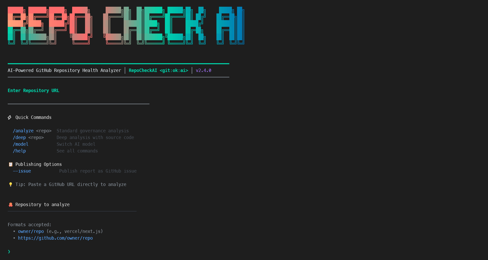

# 🚀 Getting Started

This guide will help you install RepoCheckAI and run your first repository health analysis.

> Transition note: use `repocheck` as the default command. Legacy `repodoctor` remains available only during the migration window.

---

## ⚡ Quick Start (5 minutes)

Want to see RepoCheckAI in action? Here's how to test the GitHub issue creation feature:

### 1. Get a GitHub Token

```bash
# Go to: https://github.com/settings/tokens
# Generate new token (classic) with repo scope OR granular permissions (metadata, contents, issues)
# Copy the token (often starts with ghp_ or github_pat_)
```

### 2. Test with Your Repository

```bash
# Replace with your actual token and repository
export GITHUB_TOKEN=ghp_your_token_here

# This may create one or multiple GitHub issues automatically, depending on findings/output format.
repocheck analyze your-username/your-repo --issue
```

### 3. Check the Results

Visit your repository's **Issues** tab - you should see new issues like:
- 🔴 [RepoCheckAI] docs: Missing README
- 🟠 [RepoCheckAI] ci: No CI/CD Pipeline  
- 🟡 [RepoCheckAI] dx: Code Quality Issues

**That's it!** 🎉 Each issue contains detailed analysis, impact assessment, and fix instructions.

---

## Table of Contents

## Prerequisites

Before installing RepoCheckAI, ensure you have:

### 1. Node.js (v18+)

Check your Node.js version:

```bash
node --version
# Should be v18.0.0 or higher
```

If you need to install or update Node.js:
- **Windows/macOS**: Download from [nodejs.org](https://nodejs.org/)
- **Linux**: Use [nvm](https://github.com/nvm-sh/nvm) or your package manager

### 2. GitHub Copilot Subscription

RepoCheckAI uses the GitHub Copilot SDK, which requires an active subscription:

- **GitHub Copilot Individual** - Works with free models (GPT-4o, GPT-4.1)
- **GitHub Copilot Pro/Business/Enterprise** - Full access to premium models

> **Note:** If you don't have GitHub Copilot, you can [sign up here](https://github.com/features/copilot).

### 3. GitHub Copilot CLI (Required)

RepoCheckAI uses the GitHub Copilot SDK, which requires the **Copilot CLI** installed:

```bash
# Install Copilot CLI
# Visit: https://github.com/github/copilot-cli
# Or use the direct install command for your OS
```

**Installation by OS:**

| OS | Installation |
|----|--------------|
| **macOS** | `brew install github/copilot-cli/copilot` |
| **Windows** | Download from [github.com/github/copilot-cli/releases](https://github.com/github/copilot-cli/releases) |
| **Linux** | Download from [github.com/github/copilot-cli/releases](https://github.com/github/copilot-cli/releases) |

```bash
# Verify installation
copilot --version
```

> ⚠️ **Important:** The Copilot CLI is required for the SDK to authenticate and communicate with GitHub Copilot services.
>
> 📖 Learn more: [github.com/features/copilot/cli](https://github.com/features/copilot/cli/)

### 4. GitHub CLI (Optional)

For additional GitHub authentication options, you can also install the GitHub CLI:

```bash
# macOS
brew install gh

# Windows
winget install GitHub.cli

# Linux
sudo apt install gh  # Debian/Ubuntu
```

Then authenticate:

```bash
gh auth login
```

> **Tip:** For model access, RepoCheckAI uses the GitHub CLI OAuth token. If you see `Failed to list models: 401`, follow the Copilot auth steps in [issue-publishing.md](issue-publishing.md).

### 5. GitHub Personal Access Token (For Publishing Features)

To use advanced features like creating issues or commenting on PRs, you need a GitHub Personal Access Token:

#### How to Generate a Token

1. **Go to GitHub Settings**
   - Visit [GitHub.com](https://github.com)
   - Click your profile photo → **Settings**

2. **Access Developer Settings**
   - Scroll down → **Developer settings**
   - Click **Personal access tokens**
   - Choose **Tokens (classic)**

3. **Generate New Token**
   - Click **Generate new token (classic)**
   - **Name**: `RepoCheckAI` (or descriptive name)
   - **Expiration**: Choose appropriate time (30 days recommended)
   - **Scopes**: Select minimal required permissions

#### Required Permissions

| Permission | Access Level | Purpose |
|------------|--------------|---------|
| **Metadata** | Read-only | Repository metadata (required) |
| **Contents** | Read-only | Read repository contents |
| **Issues** | Read and write | Create issues with reports |
| **Pull requests** | Read and write | Comment on PRs |

#### Usage Examples

```bash
# Set token as environment variable (recommended)
export GITHUB_TOKEN=ghp_your_token_here

# Or pass it only for a single command (avoids storing it in shell history)
GITHUB_TOKEN=ghp_your_token_here repocheck analyze owner/repo --issue
```

> **Full guide:** See [issue-publishing.md](issue-publishing.md) for step-by-step `--issue` setup and 401 troubleshooting.

#### Security Notes

- **Never commit tokens** to version control
- Use tokens with short expiration dates
- Revoke unused tokens immediately
- Consider GitHub Apps for production use

---

## Installation

### Option 1: Clone and Build (Recommended)

```bash
# 1. Clone the repository
git clone https://github.com/glaucia86/repocheckai.git

# 2. Navigate to the directory
cd repocheckai

# 3. Install dependencies
npm install

# 4. Build the project
npm run build

# 5. Link globally
npm link
```

After installation, the `repocheck` command will be available globally.

### Option 2: Development Mode

If you want to contribute or modify the code:

```bash
# Clone and install
git clone https://github.com/glaucia86/repocheckai.git
cd repocheckai
npm install

# Run in development mode (with hot reload)
npm run dev:cli
```

### Verify Installation

```bash
repocheck --version
# Should display: repocheck v2.x.x
```

---

## Your First Analysis

### Interactive Mode

The easiest way to start is with interactive mode:

```bash
repocheck
```

You'll see a welcome screen:

<p align="center">
  
</p>

1. **Enter a repository** — Type `vercel/next.js` or any public repository
2. **Select an AI model** — Choose from the list (use arrow keys)
3. **Wait for analysis** — The AI will analyze the repository
4. **Review the report** — See findings, health score, and recommendations

### Direct Analysis

You can also analyze directly from the command line:

```bash
# Analyze a public repository
repocheck vercel/next.js

# With a specific model
repocheck facebook/react --model gpt-4o

# Deep analysis (comprehensive scan)
repocheck microsoft/typescript --deep

# 🔥 NEW: Create GitHub issues automatically
export GITHUB_TOKEN=ghp_your_token_here
repocheck analyze your-username/your-repo --issue
```

### Publishing Reports to GitHub

**Want to try the publishing features?** Here's how:

> **Tip:** If you plan to use the `--issue` flag, the best model for report quality is **Claude Sonnet 4.5**.

#### Quick Test with Issues

```bash
# Set your GitHub token
export GITHUB_TOKEN=ghp_your_token_here

# Create issues for each problem found
repocheck analyze your-username/your-repo --issue

# Result: One or multiple GitHub issues created automatically, depending on findings.
```

#### Web UI (equivalent to `--issue`)

```bash
npm run dev:local-ui
```

In the Web UI form:

1. Enable `Publish to GitHub Issues`
2. Optional: fill `GitHub Token`
3. Run analysis

If `GitHub Token` is empty, the backend uses `GITHUB_TOKEN` from the server environment.

#### Interactive Mode

```bash
# Set token securely for the session
export GITHUB_TOKEN=ghp_your_token_here

# Then start interactive mode
repocheck chat
# Then type:
/analyze facebook/react --issue
/deep microsoft/vscode
```

---

## 🧪 Testing Publishing Features

Quick validation checklist:

1. Configure token with issue-write permission.
2. Run one CLI test (`repocheck analyze owner/repo --issue`) or one Web UI test (`npm run dev:local-ui` + enable `Publish to GitHub Issues`).
3. Confirm new issue(s) were created in the target repository.

If publishing fails:
- `401` in model listing: Copilot auth issue (`GH_TOKEN` path).
- `401/403` in issue creation: GitHub API token scope/access issue (`GITHUB_TOKEN` path).

For full step-by-step setup, token scope matrix, and troubleshooting, use:
- [Issue Publishing Guide](issue-publishing.md)

---

## Understanding the Report

After analysis, you'll receive a health report like this:

### Health Score

```
📊 Repository Health Score: 78%

| Category              | Score | Issues |
|-----------------------|-------|--------|
| 📚 Docs & Onboarding  | 85%   | 1 P2   |
| ⚡ Developer Experience| 90%   | 0      |
| 🔄 CI/CD              | 70%   | 1 P1   |
| 🧪 Quality & Tests    | 65%   | 1 P1   |
| 📋 Governance         | 80%   | 1 P2   |
| 🔐 Security           | 75%   | 1 P1   |
```

### Priority Levels

| Priority | Meaning | Action Required |
|----------|---------|-----------------|
| **P0** 🔴 | Critical blocker | Fix immediately |
| **P1** 🟠 | High impact | Fix soon |
| **P2** 🟡 | Nice to have | Consider improving |

### Sample Finding

```
🔴 P0 — Missing LICENSE File

📍 Evidence: No LICENSE file found in repository root
💥 Impact: Users cannot legally use or contribute to this project
✅ Action: Add a LICENSE file. Recommended: MIT for open source projects

   # Create MIT License
   curl -o LICENSE https://opensource.org/licenses/MIT
```

### Saving Your Report

After analysis, you can:

```bash
/copy          # Copy to clipboard
/export        # Save as markdown file
/export json   # Save as JSON
```

---

## Next Steps

Now that you've run your first analysis:

### Learn More

- 📖 [User Guide](GUIDE.md) — Complete command reference
- 🤖 [AI Models](AI-MODELS.md) — Choose the right model for your needs
- 📊 [Analysis Categories](analysis-categories.md) — What gets analyzed

### Analyze Your Repositories

```bash
# Your organization's repos
repocheck your-org/your-repo

# Private repositories (requires token)
export GITHUB_TOKEN=ghp_xxxxx
repocheck your-org/private-repo
```

### Publishing Features

With a GitHub Personal Access Token, you can automatically publish analysis reports:

#### Create Issues with Reports

```bash
# Create a GitHub issue with the complete analysis
GITHUB_TOKEN=ghp_your_token repocheck analyze owner/repo --issue

# The issue includes:
# - Title: "RepoCheckAI Report: owner/repo"
# - Labels: Based on findings (docs, dx, ci, security, etc.)
# - Body: Full analysis report in Markdown format
```

#### Interactive Mode

```bash
repocheck chat
# Then use:
/analyze owner/repo --issue
/deep owner/repo
```

### Integrate into Workflow

- Run RepoCheckAI before major releases
- Use it in CI/CD for automated health checks
- Share reports with your team
- **Auto-publish issues** for tracking repository improvements
- **PR comments** for real-time feedback during code reviews

### Join the Community

- ⭐ [Star the repository](https://github.com/glaucia86/repocheckai)
- 🐛 [Report issues](https://github.com/glaucia86/repocheckai/issues)
- 💡 [Suggest features](https://github.com/glaucia86/repocheckai/discussions)
- 🤝 [Contribute](CONTRIBUTING.md)

---

## Troubleshooting Installation

### "command not found: repocheck"

The global link wasn't created properly:

```bash
# Try relinking
npm unlink repocheck
npm link

# Or run directly
npx repocheck
```

### "Cannot find module" errors

Dependencies might be missing:

```bash
rm -rf node_modules
npm install
npm run build
```

### Authentication issues

If you see authentication errors:

```bash
# Option 1: Use GitHub CLI
gh auth login

# Option 2: Set token manually
export GITHUB_TOKEN=ghp_xxxxx
```

See [Troubleshooting](troubleshooting.md) for more solutions.

---

<p align="center">
  <a href="index.md">← Back to Documentation</a> •
  <a href="GUIDE.md">User Guide →</a>
</p>


